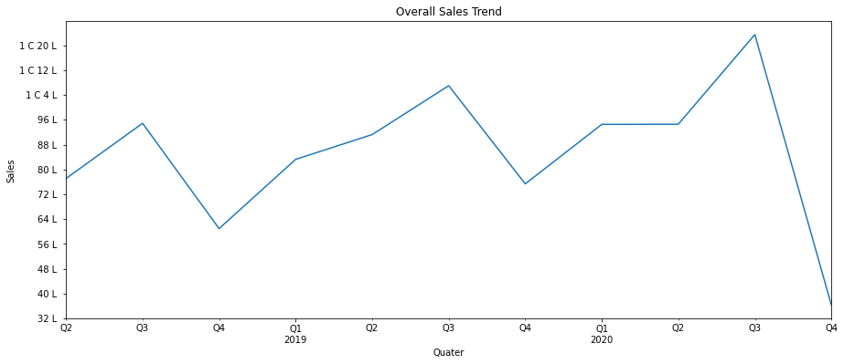
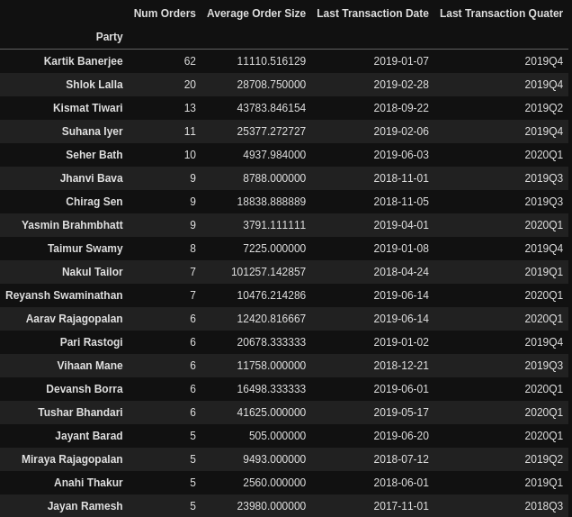

# B2B Sales Analysis
We have data recording sales made by a company in span of ~3 years. Each datapoint contains, most basic info like name of customer, total value of transaction etc. The data needs to be cleaned before it can be used.

# Purpose
Analysis without actionalble insights, is just a fancy play. Our goal is to give the company insight into its sales data and suggest where improvements could be made.

# Where does your business come from?

## Around 65% Sales Each Quater Comes From 30 Companies.

## Around 92% Sales Each Quater Comes From 6 States.

# Repeat Customers And Customers Churn.

## 44.95% Of Your Customers have made just 1 order with you.
## You've excellent repeat customer rate of ~70%
## Every Quater You Lose 10-30% Of New Customers you acquired in previous quater.

List of your valuable customers, who you might be loosing.

# Customer Segemetation

There are four segments of your customers most of your business comes from 2 or these 4 segments.

# Actions

## Create Sales Target For Major States
## Create Sales Target For Customer Segments
## Proactively find and reduce churned customers
## Find out why so many customers place just 1 order with you
## Invest in good CRM Software